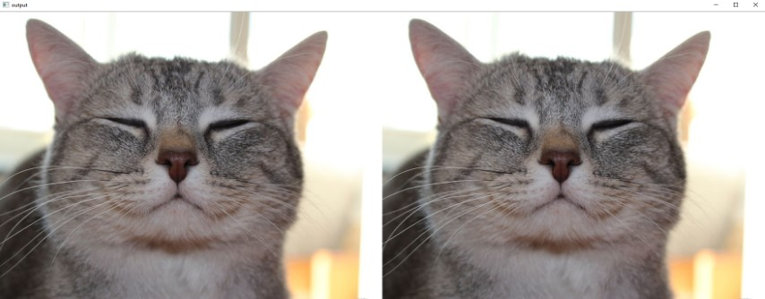
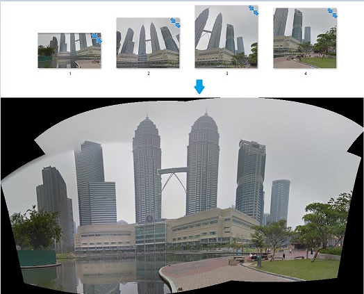
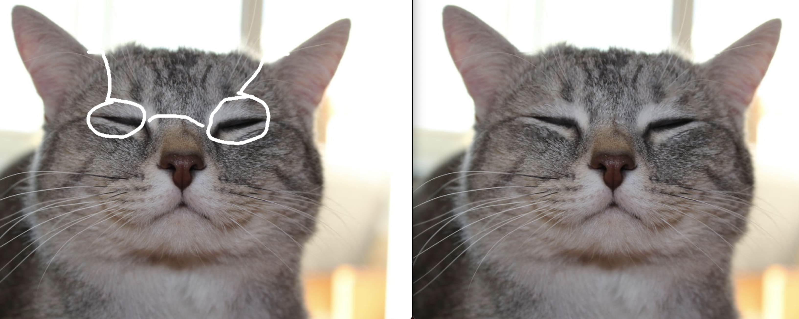

# OpenCV Starter Pack

## Objectives
Provide Example codes and code snippets for OpenCV in Python, C++, Java(WIP)

### How to start?
`pip install opencv-python`

### Common starter codes
- [Basic functions](python/basic)
    - [Open Video](python/basic/open_video.py)
    - [Open Webcam](python/basic/open_webcam.py)
    - [Open Image](python/basic/open_image.py)
    - [Save webcam frames to video](python/basic/video_writer.py)
- [Image Transformation](python/examples/transformation)
- [Image Thresholding](python/basic/threshold_image.py)

### Common real life applications
- [Read frame from Threaded Camera Stream](python/examples/threadedVideoCapture)
- [Calculate FPS](python/basic/calculate_FPS.py)
- [Viola Jones Face Detection using Haar Cascades](python/examples/face-detection)
- [Open multiple webcams](python/examples/multi-threading/open_multiWebcam.py)
- [Overlay image on Webcam frame](python/examples/overlay_camera)
- [OpenCV Fullscreen](python/basic/open_fullscreen.py)
- [OpenCV in Portrait Mode](python/basic/potrait.py)
- [Overlay picture on picture](python/basic/overlay.py)
- [Correct orientation of a document](python/examples/deskew-document)  

- [View two frames side by side](python/basic/hstack.py)  

- [Auto Image Stitching](python/examples/image_stitching/)  

- [Image inpainting](python/example/inpainting/main.py)
  

### Deployment 
- [Streamlit example](python/deployment/streamlit/)  

### Common functions
- [Edge Detection](python/examples/edge-detection)  
- [Warping](python/examples/transformation)

### Finding Real World Coordinates of a ball detected using OpenCV
- [Converting 2D coordinates to 3D coordinates using calibration matrix](python/examples/2d_to_3d_coordinates)
